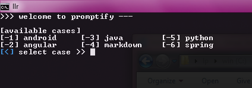
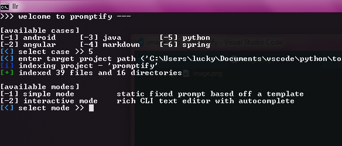
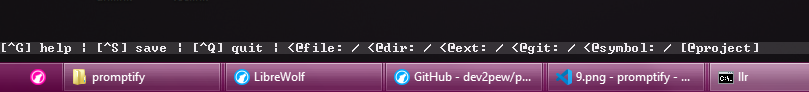
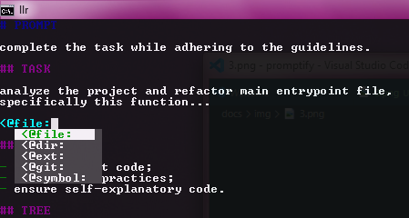
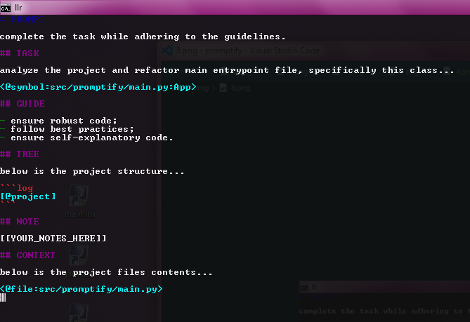
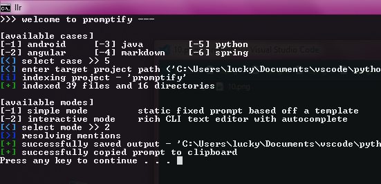

# README

`promptify` is an asynchronous CLI tool designed to bridge the gap between your local source code and LLMs. It allows you to "attach" project context—specific files, entire directories, file types, directory trees, and even specific symbols or git diffs—directly into your prompts using a clean, mention-based syntax.

## WHAT

`promptify` uses a Case-based system. Each "Case" represents a specific workflow (e.g., "Refactor", "Documentation", "Bug Fix") with its own prompt templates and exclusion rules (`.caseignore`). It allows you to build massive, context-rich prompts without the manual copy-paste headache.

## FEATURES

### GENERAL

- built on `asyncio` with structured concurrency (`TaskGroup`) and `aiofiles` for fully non-blocking, high-performance file I/O and mention resolution;
- uses `watchdog` to maintain an in-memory map of your project, paired with `rapidfuzz` for ultra-fast, near-instant fuzzy autocomplete even in massive codebases;
- strict path validation ensures the tool never reads files outside of your specified project directory;
- automatically detects language extensions to wrap code in appropriate Markdown fences (e.g., `python`);
- advanced AST-like symbol extraction powered by `pygments` to target specific classes and methods;
- native `git` integration for pulling working tree status and diffs.

### MODES

#### SIMPLE

Also known as legacy mode. Perfect for static, repeatable workflows. It reads a `legacy.md` template from your Case directory and resolves all mentions in a single pass.

>[!example] Use Case
>
> Generating a standard "Code Review" report for a specific file.

#### INTERACTIVE

A rich terminal-based text editor for crafting complex, one-off prompts.

- type `<@` to trigger a fuzzy-search menu for files, folders, extensions, symbols, and git commands;
- resolves mentions exactly once. This prevents "Prompt Leaks"—if your source code contains `<@file:...>` strings, `promptify` treats them as static text rather than trying to resolve them recursively;
- features real-time syntax highlighting, trailing whitespace detection, EOF newline indicators, and matching bracket highlighting.

##### CONTROLS

The editor is powered by `prompt-toolkit` and supports standard IDE shortcuts...

---

| Hotkey | Action |
| :-- | :-- |
| App Controls | |
| `[Ctrl]` + `[S]` | Save and generate final prompt |
| `[Ctrl]` + `[Q]` | Quit without saving |
| `[Ctrl]` + `[G]` or `[F1]` | Toggle the Help overlay |
| ... | ... |
| Editing | |
| `[Ctrl]` + `[C/X/V]` | Copy / Cut / Paste |
| `[Ctrl]` + `[Z/Y]` | Undo / Redo |
| `[Ctrl]` + `[/]` | Context-aware commenting (wraps selection in `#` or `//` based on cursor position) |
| `[Tab]` / `[Shift]` + `[Tab]` | Trigger autocomplete / Indent / Unindent (4 spaces) |
| `[Alt]` + `[Up/Down]` | Move current line up or down |
| `[Ctrl]` + `[W]` | Delete previous word |
| `[Ctrl]` + `[Delete]` | Delete next word |
| `[Enter]` | Insert newline / Apply selected autocomplete |
| ... | ... |
| Navigation & Selection | |
| `[Ctrl]` + `[A]` | Select All |
| `[Shift]` + `[Arrows]` | Text selection |
| `[Ctrl]` + `[Arrows]` | Move cursor word by word |
| `[Shift]` + `[Ctrl]` + `[Arrows]` | Select word by word |
| `[Home/End]` | Move cursor to the start or end of the line |
| `[Shift]` + `[Home/End]` | Select to the start or end of the line |
| `[Ctrl]` + `[Home/End]` | Move cursor to the start or end of the file |
| `[Shift]` + `[Ctrl]` + `[Home/End]` | Select to the start or end of the file |
| `[PageUp/PageDown]` | Move cursor up or down by 15 lines |
| `[Shift]` + `[PageUp/PageDown]` | Select up or down by 15 lines |

---

##### MENTIONS

---

| Tag | Description | Example |
| :-- | :-- | :-- |
| `<@file:path>` | Attaches a specific file. | `<@file:src/main.py>` |
| `<@file:path:range>` | Attaches a specific line slice. Supports `first N`, `last N`, `N-M`, or `#LN`. | `<@file:app.py:10-20>` or `<@file:app.py:first 50>` |
| `<@dir:path>` | Attaches all allowed files in a folder. | `<@dir:src/utils>` |
| `<@ext:list>` | Attaches files by extension (comma-separated). | `<@ext:py,ts>` |
| `<@symbol:path:name>` | Attaches a specific class, method, or function using AST extraction. | `<@symbol:src/app.py:MyClass.my_method>` |
| `<@git:diff>` | Attaches the current working tree diff. | `<@git:diff>` |
| `<@git:diff:path>` | Attaches the working tree diff for a specific file or folder. | `<@git:diff:src/>` |
| `<@git:status>` | Attaches the current working tree status. | `<@git:status>` |
| `[@project]` | Generates a TREE /F style directory map. | `[@project]` |

---

### CASES

Define your workflows in the `cases/` directory...

```log
cases/
└── my-feature/
    ├── config.json    # Define allowed file types
    ├── .caseignore    # Rules like '*.log' or 'secret.key'
    ├── prompt.md      # Initial text for Interactive Mode
    └── legacy.md      # Template for Simple Mode

```

### TESTING

`promptify` is built with a "Test-First" mentality.

- all core logic is verified via `pytest` and `pytest-asyncio`, with graceful CI/CD console fallbacks;
- tests generate a temporary filesystem to verify indexing, line-slicing, and loop prevention without touching your actual data;
- strictly formatted and linted using Ruff for Python 3.13+ compatibility.

Run Tests...

```bash
uv run pytest -v

```

Format Code...

```bash
uv run ruff format src/ tests/

```

---

### INSTALL

1. Get [uv](https://github.com/astral-sh/uv);
2. Setup using...

```bash
uv sync

```

1. Run using...

```bash
uv run promptify

```

Or via the module entry point...

```bash
uv run python -m promptify

```

---

### GUARDS

- prevents reading files larger than 5MB; (configurable)
- if using `resolve_system`, the engine detects infinite loops (e.g., `A.md` calls `A.md`) and neutralizes them with an HTML warning comment;
- limits concurrent file reads to 100 to prevent OS file descriptor exhaustion;
- gracefully handles missing `git` installations or missing `.git` repositories.

## DEMO

4 minute long animated walkthrough on the interactive editor and basic usage...


### MENU

the app opens to a welcome screen that lists available use cases.



you can pick a working mode from the menu...

- either `simple` or `interactive`

...before entering the editor.



### EDITOR

#### OVERVIEW

the editor is where you compose prompts and attach project files or symbols. it's an interactive, terminal-based editor with helpful UI elements and keyboard shortcuts.


a toolbar at the bottom shows available shortcuts and controls so you always know how to navigate and use mentions.



#### CALLS

type `<@` to trigger mentions AKA calls in the editor. mentions let you quickly attach files from the project into your prompt, so you can include file contents without leaving the editor.



#### SUGGESTIONS

the editor offers fuzzy matching, autocompletion, and suggestions (powered by the `prompt-toolkit` library) to speed up selection.

for example, typing `read` brings up `README.md` in the suggestions list.


fuzzy matching also works for file paths - here we use `main.py` to attach `/src/promptify/main.py`.


...and here's the result after selecting main.py from the suggestions...


#### SYMBOLS

the editor can parse source files, cache symbols, and let you attach specific symbols (classes, functions, etc.) into your prompt. this is useful when you need only a fragment of a file.


a typical prompt in promptify shows resolved mentions inline before you save or run it.



when you resolve and run the prompt, promptify copies the final prompt to your clipboard and prints the full output in the terminal.


